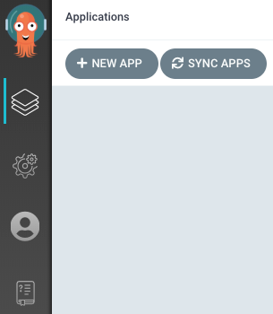
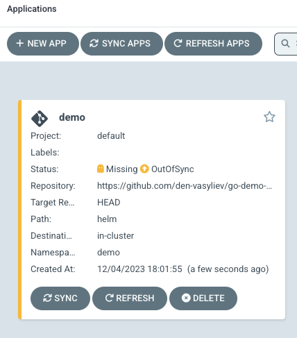
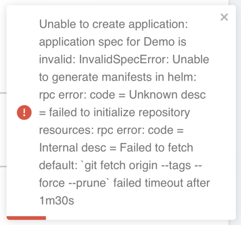
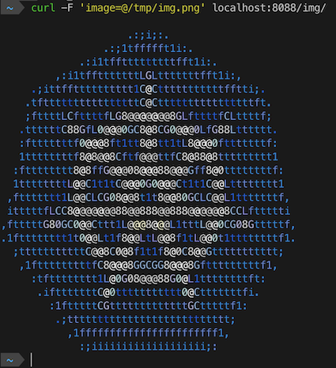

# Презентація MVP AsciiArtify

## Створення нового застосунку

Для демонстрації MVP в нас має бути розгорнутий Kubernates кластер зі встановленим ArgoCD. 
(Див. [POC.md](POC.md))

Для розгортання ми будемо використовувати офіційну документацію
https://argo-cd.readthedocs.io/en/stable/getting_started/

Заходимо в вебінтерфейс ArgoCD. Створюємо новий проект - натискаємо `+ NEW APP`



У розділі `GENERAL` вказуємо назву наступні параментри - 
- Application Name - `demo`
- Project Name - `default`
- sync policy - `Manual` - залишаємо значення по замовчуванню

Ставимо галочку у полі - `AUTO-CREATE NAMESPACE` - тут важливо вказати ArgoCD щоб створив новий namespace так як в helm цю функцію за замовчуванням прибрали.

У розділі `SOURCE`
- Repository URL - `https://github.com/den-vasyliev/go-demo-app` - репозиторій з нашим застосунком
- Path - `helm` - шлях до каталогу helm

Це може зайняти тривалий час. Також на цьому етапі можливе виникнення помилки - див.нижче

В розділі `DESTINATION` вкажемо url локального кластеру та Namespace demo після чого ArgoCD автоматично визначить параметри додатку використавши маніфести, які знаходяться в репозиторії.
- Cluster URL - `https://kubernetes.default.svc`
- Namespace - `demo`

Створюємо додаток кнопкою `CREATE`

Додаток має створитись:



Натискаємо кнопку `SYNC` та чекаємо, коли додаток завершить синхронізацію.
На цьому етапі з ArgoCD ми завершили.

Якщо виникла помилка після вказання репозиторію і не підтягнуло helm:



Це означає, що ArgoCD не встигає стягнути репозиторій. Потрібно дати більше часу на це (по замовчуванню 1хв30сек).
Це можна зробити, додавши наступну змінну оточення:

```shell
ARGOCD_EXEC_TIMEOUT="10m"
```

Відкриємо Argo CD server deployment маніфест

```shell
kubectl edit deployment argocd-server -n argocd
```

Знаходимо секцію `containers` під `spec.template.spec` та додаємо ще одну змінну `env`:

```yaml
spec:
  template:
	spec:
	  containers:
	  - name: argocd-server
		env:
		- name: ARGOCD_EXEC_TIMEOUT
		  value: "3m"
```

Та зберігаємо зміни. Деплоймент має обновитись автоматично.

Перевіримо, що зміни були застосовані:

```shell
kubectl get pods -n argocd -l app.kubernetes.io/name=argocd-server -o name
pod/argocd-server-6ccdb44b8d-fpp4x

kubectl exec -n argocd pod/argocd-server-6ccdb44b8d-fpp4x -- printenv | grep ARGOCD_EXEC_TIMEOUT
ARGOCD_EXEC_TIMEOUT=3m
```


## Демонстрація роботи застосунку

Перевіряємо роботу застосунку AsciiArtify.

Спочатку переадресуємо порти наступною командою

```shell
kubectl port-forward -n demo svc/ambassador 8088:80

Forwarding from 127.0.0.1:8088 -> 80
Forwarding from [::1]:8088 -> 80
```

Перевіряємо, чи додаток доступний. Має повернутись версія додатку

```shell
curl localhost:8088

k8sdiy-api:599e1af%      
```

Завантажимо довільне зображення з інтернету, та збережемо локально

```shell
curl -o /tmp/img.png https://upload.wikimedia.org/wikipedia/commons/thumb/3/39/Kubernetes_logo_without_workmark.svg/247px-Kubernetes_logo_without_workmark.svg.png
```

Передаємо завантажену картинку як payload на сервіс та отримуємо результат в консолі

```shell
curl -F 'image=@/tmp/img.png' localhost:8088/img/


                     .:;i;:.
                 .:;1tffffft1i:.
             .:i1tfftttttttttfft1i:.
         ,:i1tfftttttttLGLtttttttfft1i:,
     .;ittfftttttttttt1C@Ctttttttttttfftti;.
    .tfttttttttttttttttC@Cttttttttttttttttft.
    ;fttttLCfttttfLG8@@@@@@@8GLfttttfCLttttf;
   .ttttttC88GfL0@@@0GC8@8CG0@@@0LfG88Ltttttt.
   :ftttttttf0@@@8ft1tt8@8tt1tL8@@@0ftttttttf:
   1ttttttttf8@8@@8Cftf@@@ttfC8@88@8ttttttttt1
  :ftttttttt8@8ffG@@@08@@@88@@@Gff8@0ttttttttf:
  1ttttttttL@@C1t1tC@@@0G0@@@Ct1t1C@@Ltttttttt1
 ,fttttttt1L@@CLCG08@@8t1t8@@80GCLC@@L1tttttttf,
 itttttfLCC8@@@@@@@88@@888@@888@@@@@@8CCLfttttti
,ftttttG80GC0@@Cttt1L@@@8@@@L1tttL@@0CG08Gtttttf,
.1ftttttttt1t0@@Lt1f8@@LtL@@8f1tL@@0t1ttttttttf1.
  ;tttttttttttC@@8C0@8f1t1f8@0C8@@Gttttttttttt;
   ,1ftttttttttfC8@@@8GGCGG8@@@8Gftttttttttf1,
     :tftttttttt1L@0G08@@@88G0@L1ttttttttft:
      .iftttttttC@0ttttttttttt0@Ctttttttfi.
        :1ftttttCGtttttttttttttGCtttttf1:
         .;ttttttttttttttttttttttttttt;
           ,1fffffffffffffffffffffff1,
             :;iiiiiiiiiiiiiiiiiii;:
```



Запис демонстації

[](https://asciinema.org/a/s0F1BQK7lTfIi4ACGRkZJWU2m)
